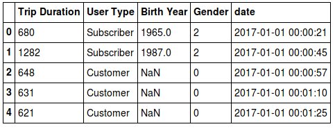
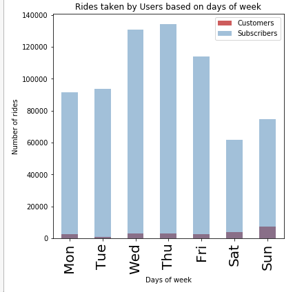
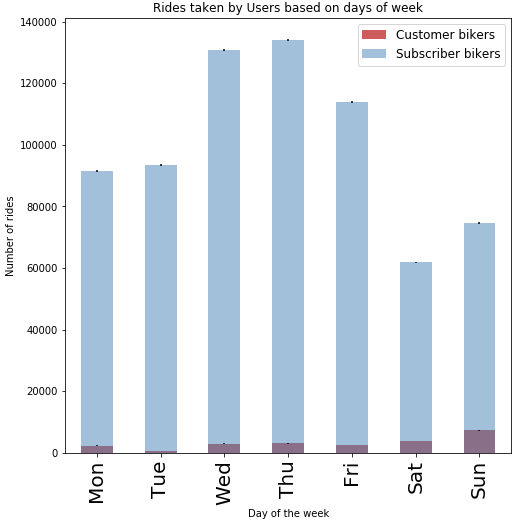
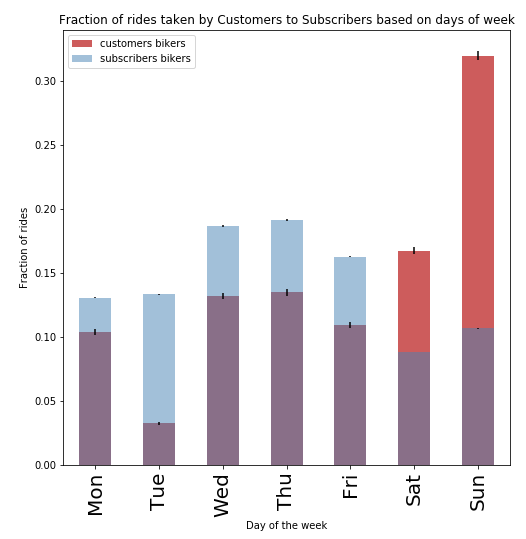

Authorea Link to Article (https://www.authorea.com/211543/DSxU_Pciv8nJB7VrVEHEAQ)

New York City rides on Citi-Bikes : A Daily Commute or a Fancy Ride     
Praveen (New York University Shanghai)
Add CollaboratorManage

### Abstract:
Citi-Bike Subscribers are more likely to utilize the bikes on weekdays than the customers. It can be observed from the Citi Bike data that the Number of trips taken by Subscribers is high during the weekdays and Number of trips taken by Customers are high during as compared to the weekends. This might be attributed to the fact that the users who use the Citi-Bikes regularly for work commute subscribe to the Annual Plan. The Ratio of Customers to Subscribers utilizing the service is high on weekdays and low on the weekends. Z-Test was conducted to prove the correlation of this study and confirmed the fact that Subscribers take more rides than the Customers during Weekdays.

### Introduction: 
Citi-Bike a Bike Sharing Platform that began its operations in NYC in 2013 has over 10,00 vehicles, 706 Stations and serviced over 22 Million rides until 2016 [1]. They operate on two methodologies i. Citi-bike Annual Subscription service for Subscribers and ii. A 24-hour pass or a 3-day pass for Customers [2]. In this Article, we try to derive a correlation between the No. of Rides taken by Subscribers to the No. of Rides taken by the Customers during Weekdays and Weekends. This will help us derive a conclusion on whether Citi-Bike is used more as a Daily Commute mode or by Tourists to explore the city.
Data-Analysis: To perform this analysis, we utilize the publicly available dataset posted by the Citi-Bike for the month of January 2017 which is available at this link. We then clean the dataset to the required parameters of User Type, No. of Trips Taken, and the Day of the Trip.  To Simplify the analysis, and since the User Type data is dichotomous (Either Customer or Subscriber) we assign them a Binary Value of 0 & 1 respectively and filter out the individual trip counts on Weekdays and Weekends.

Fig. 1

Filtered Data from Citi-Bike for the Month of January 2017    

Methodology – To identify the relative usage of Citi bike Subscribers over the Customers, a ratio of the number of trips taken by the Customers to the Subscribers were utilized. This ratio was computed for both for Weekdays and Weekends. The same is depicted is the below figure.

Fig. 2

No. of Rides taken by Customers & Subscribers Segregated by day of the Week

 

 The degree of error in the data was also plotted to ensure that this correlation is not due to erratic data.  if this correlation. For this purpose, a Normalized Error was introduced to the data and the result was plotted which is as below.

 

Fig. 3

No. of Rides taken by Customers & Subscribers Segregated by day of the Week with Error Bars  

Finally, a Z-Test was conducted on the sample to see if the presented hypothesis holds true and he Z-Test yielded highly satisfactory result of -62.5, that signifies a very low P Value and that the formulated Null Hypothesis - " Customers take the same or more number of rides during the weekdays" can be falsified
Conclusions – From the above analysis it is clearly evident that Most of the weekday rides are carried out by Citi-Bike Subscribers and Most of the weekend rides are carried out by Citi-Bike Customers. The same can also be observed from the below figure where the fraction of Rides taken by Customers to Subscribers Segregated by day of the Week is plotted.
 

Fig. 4.

Fraction of Rides taken by Customers to Subscribers Segregated by day of the Week

This test was done utilizing the data for only one month, a further strong evidence could be derived if the similar analysis is repeated for datasets of different months and for varying seasons. However, the key takeaway for Citi bike to gain furthermore subscribers and to expand further would be by installing stations close to corporate office buildings and Industrial Parks.
"Citibike is a Daily Commute for Subscribers and a Fancy Ride for Customers."
Bibliography
[1] K. E. Thomas, "What 22 Million Rides Tell Us About NYC Bike-Share," 28 January 2016. [Online]. Available: https://nextcity.org/daily/entry/citi-bike-new-york-city-bike-share-data.
[2]  Citibike, "Citibike Data," [Online]. Available: https://www.citibikenyc.com/system-data.

